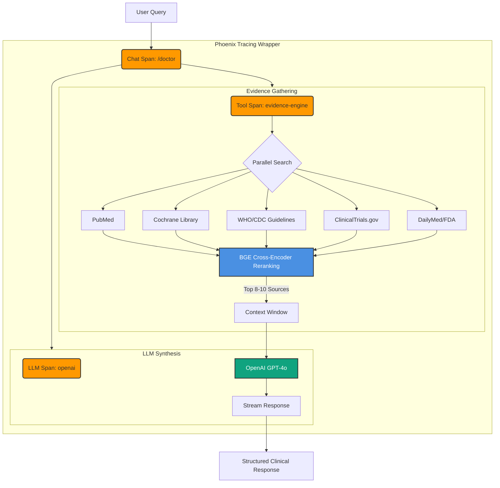

# System Workflow Diagrams

## Doctor Mode Workflow



## General Mode Workflow

```mermaid
graph TD
    UserQuery[User Query] --> ChatSpan
    
    subgraph Phoenix_Tracing [Phoenix Tracing Wrapper]
        direction TB
        ChatSpan(Chat Span: /general)
        
        ChatSpan --> EvidenceStep
        ChatSpan --> ImageStep
        ChatSpan --> LLMStep
        
        subgraph EvidenceStep [Evidence Gathering]
            EvidenceSpan(Tool Span: evidence-engine)
            
            EvidenceSpan --> ParallelSearch{Parallel Search}
            ParallelSearch --> PubMed[PubMed]
            ParallelSearch --> MedlinePlus[MedlinePlus]
            ParallelSearch --> Guidelines[CDC/WHO Guidelines]
            
            PubMed & MedlinePlus & Guidelines --> Reranking
            
            Reranking[BGE Cross-Encoder Reranking]
            Reranking -- "Top 5 Sources" --> Context[Context Window]
        end
        
        subgraph ImageStep [Image Retrieval]
            ImageSpan(Tool Span: image-retrieval)
            
            ImageSpan --> OpenI[Open-i (NLM)]
            OpenI -- "Relevant Images" --> Context
        end
        
        subgraph LLMStep [LLM Synthesis]
            LLMSpan(LLM Span: openai)
            
            Context --> GPT4oMini[OpenAI GPT-4o-mini]
            GPT4oMini --> ResponseGen[Stream Response]
        end
    end
    
    ResponseGen --> FinalResponse[Consumer-Friendly Response]
    
    style ChatSpan fill:#ff9900,stroke:#333,stroke-width:2px
    style EvidenceSpan fill:#ff9900,stroke:#333,stroke-width:2px
    style ImageSpan fill:#ff9900,stroke:#333,stroke-width:2px
    style LLMSpan fill:#ff9900,stroke:#333,stroke-width:2px
    style Reranking fill:#4a90e2,stroke:#333,stroke-width:2px,color:white
    style GPT4oMini fill:#10a37f,stroke:#333,stroke-width:2px,color:white
```
