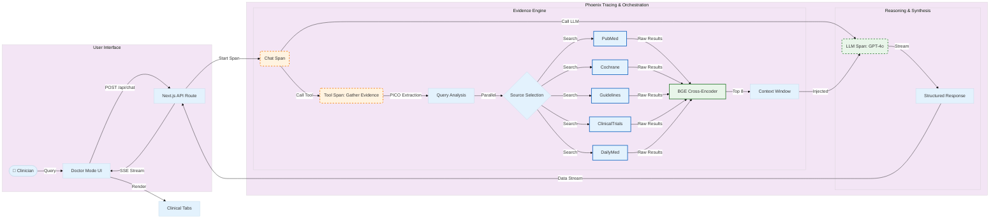
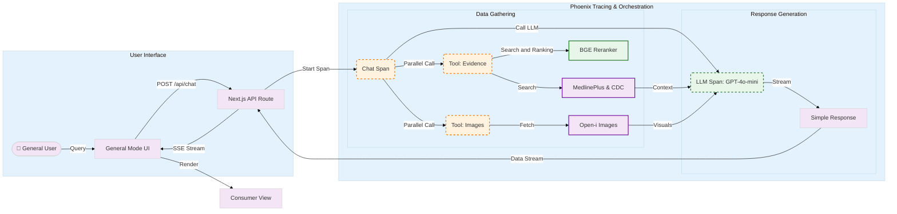

# System Architecture & Workflows

## 🏥 Doctor Mode Architecture

A high-precision clinical research workflow dealing with complex medical queries.

## 🧠 General Mode Architecture

A simplified, educational workflow optimized for speed and accessibility.

